# Flying helicopters in Wardogs with a TBS Tango 2

[](https://buymeacoffee.com/deanyo)

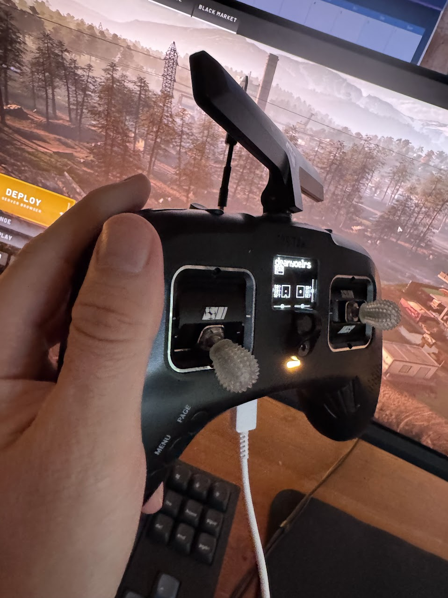

A practical, **tested personal configuration** for using a TBS Tango 2 FPV radio as a Windows USB joystick / helicopter controller in Wardogs. Includes a FreedomTX switch setup and an optional AutoHotkey workaround for the tactical-map tooltip covering the helicopter.

> **Firmware matters:** This radio reports `fdtX-tango`, **TBS-1.3.5 (dd3f9713)**, built **2022-05-10 11:59:01**. It is **FreedomTX (TBS's OpenTX fork), not EdgeTX**. Menu names and USB behaviour may differ on other firmware or radio revisions. This is a record of a working setup, not a universal preset. Back up your radio model before changing mixes or logical switches. Do not use a game-specific model for flying real aircraft without independently checking every channel and failsafe.

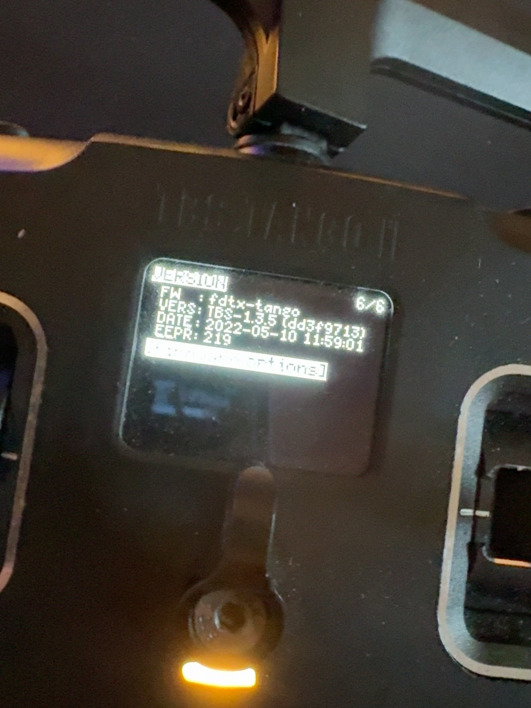

## What you need

- TBS Tango 2 with a dedicated model for PC gaming, connected by a **data-capable USB cable**; choose its USB joystick mode when prompted.
- Wardogs on Windows; enable **HOTAS** under **Settings → Gamepad → HOTAS**.
- Windows `joy.cpl` (press Win+R and enter `joy.cpl`) to inspect the actual joystick axes and buttons.
- Optional: [AutoHotkey v2](https://www.autohotkey.com/) for the tactical-map cursor workaround.

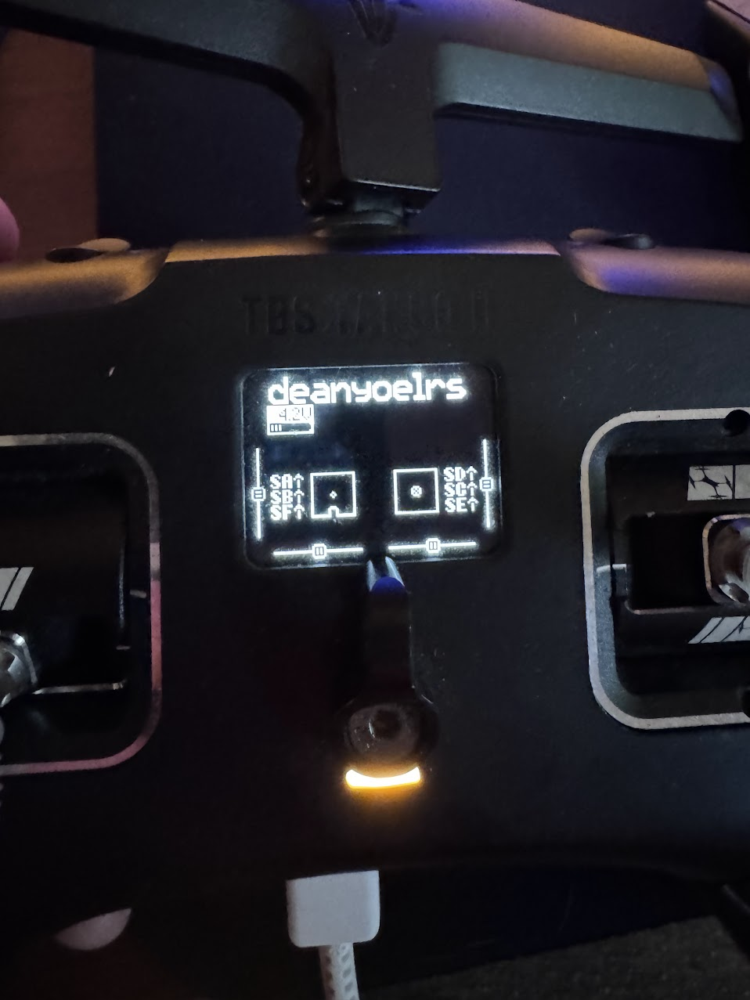

## 1. Stick inputs and channel mixes

The radio's four main inputs are `Thr`, `Ail`, `Ele`, `Rud`, each at 100% in the photographed Inputs/Mixes configuration. Additional switch mixes occupy later channels; do not assume that a radio channel number equals the Windows joystick button number.

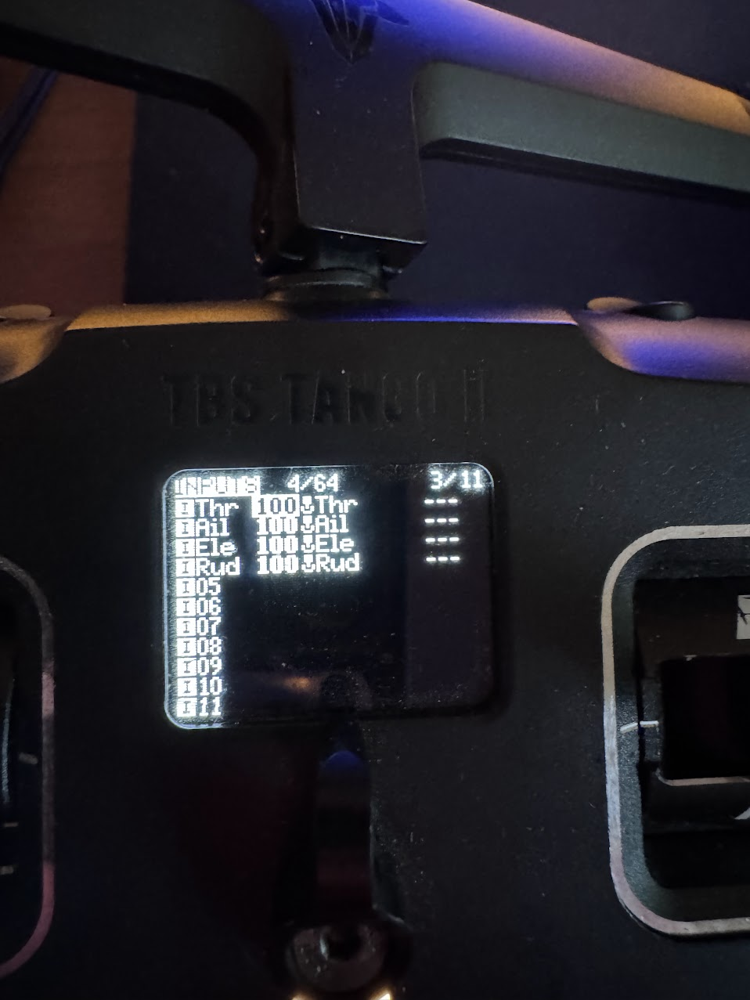
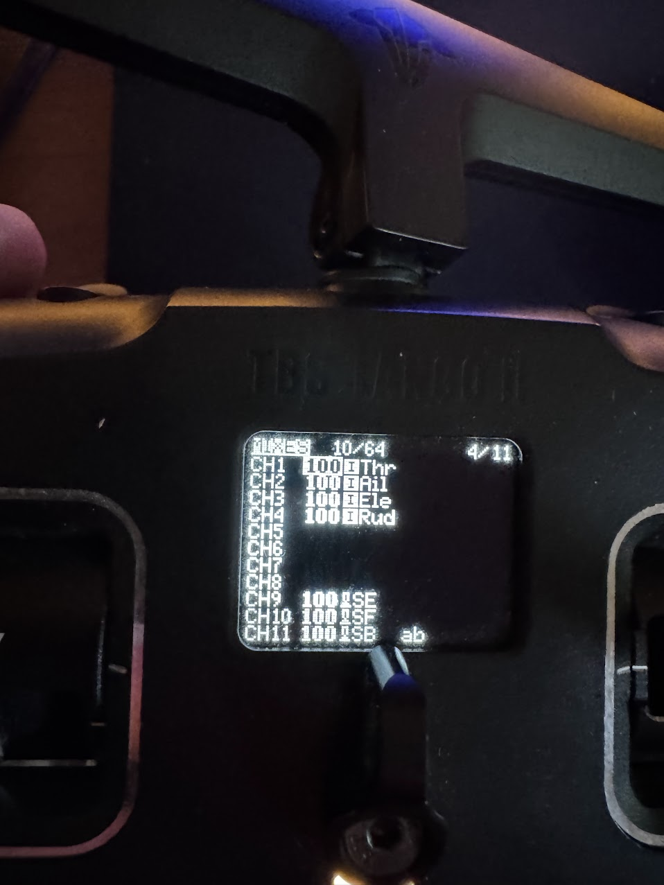
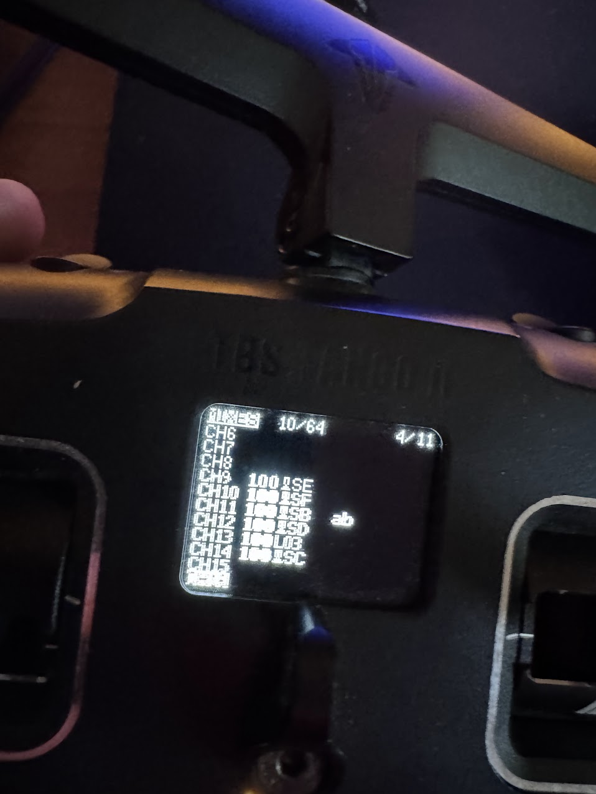

### Tested Wardogs HOTAS axes

| Wardogs control | Binding shown in game | Setting shown |
| --- | --- | --- |
| Roll left / right | Axis 1− / Axis 1+ | Invert disabled; sensitivity 1.00; deadzone 0.03 |
| Pitch up / down | Axis 2− / Axis 2+ | Invert enabled; sensitivity 1.00; deadzone 0.03 |
| Yaw left / right | Axis 3− / Axis 3+ | Invert disabled; sensitivity 1.50; deadzone 0.03 |
| Collective up / down | Axis 0+ / Axis 0− | Invert disabled; sensitivity 1.00; deadzone 0.03; **self-centring collective disabled** |

These are **the game's observed axis numbers**, not an instruction to change the physical stick mode. The non-self-centring throttle stick is used as collective. Check axis directions in-game and invert as required for your own setup.

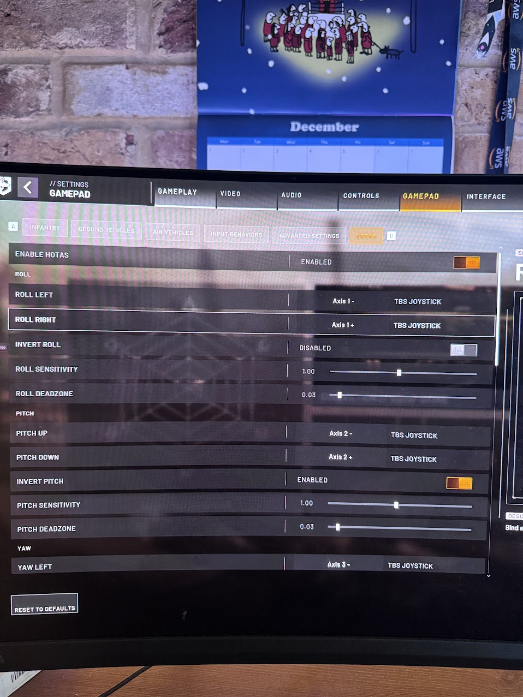
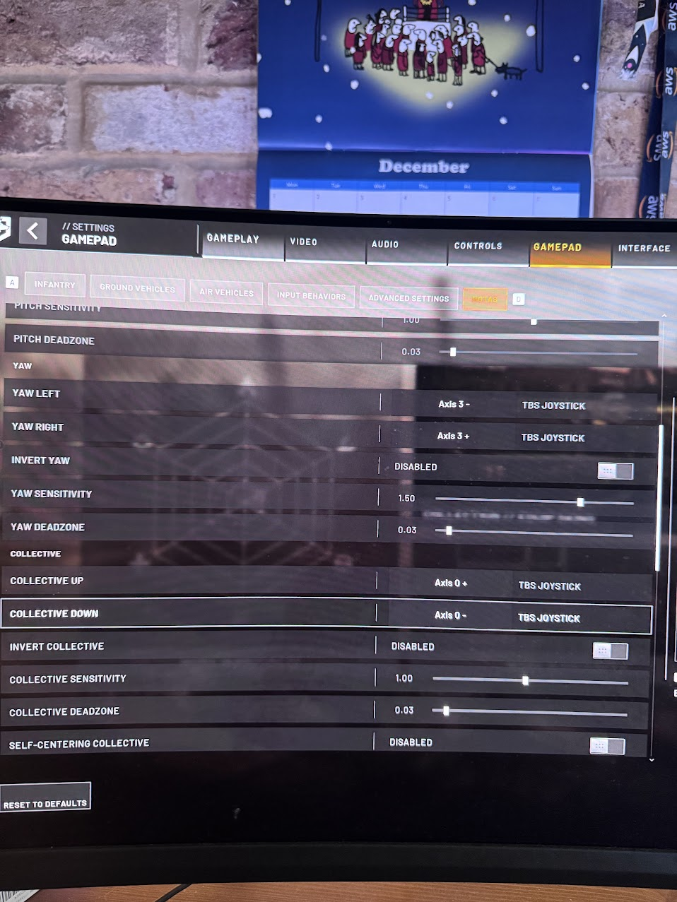
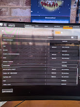

## 2. Three-position rocker: both ends, one action

A **three-point V-shaped curve** (`CV1`, named `ab` on this radio) makes both end positions of the three-position rocker produce the same output while the middle remains neutral. The photographed CH11 mix uses `SB` and this curve. This is useful for an action that should activate at either end of a three-position switch.

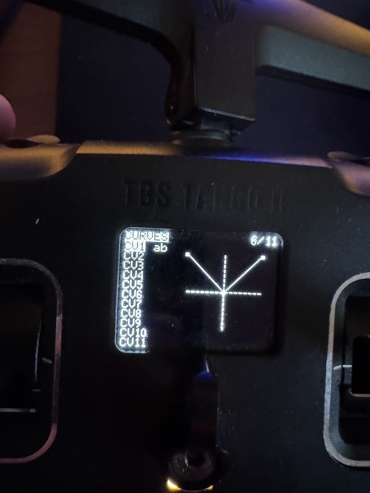

The actual three-point curve is:

| Point | X (input) | Y (output) |
| --- | ---: | ---: |
| Left | -100 | +100 |
| Centre | 0 | 0 |
| Right | +100 | +100 |

This is a **V**, not a six-point flat-bottomed notch. Use the photographed FreedomTX radio screen as the visual reference. A separate six-point Companion editor screenshot discussed during setup was **not** this radio's configuration and is deliberately excluded from the guide. Verify the actual channel output in the radio's channel monitor and then in `joy.cpl`.

## 3. Two-position rocker: momentary pulse in either direction

A plain two-position switch stays high or low, whereas some game actions need a short **button press** each time you flick it. On this radio the working approach is to combine two edge-detection logical switches:

| Logical switch | Function | Input |
| --- | --- | --- |
| L01 | Edge | SA↓ |
| L02 | Edge | SA↑ |
| L03 | OR | L01, L02 |

The photograph shows the edge conditions and OR logic. The exact small timing fields are not sufficiently legible to publish as guaranteed values; inspect the radio and adjust the pulse so Windows reliably registers it. Very short pulses can be missed; rapid retriggers may need a longer gap between flicks.

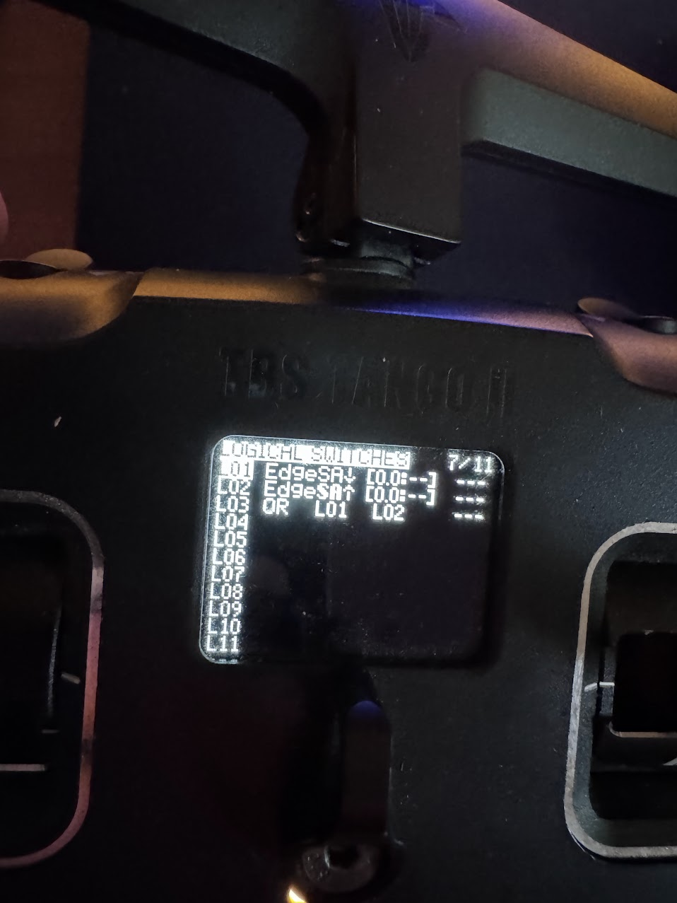

**CH13 mix (photographed):** Source `L03`, weight `100`, offset `0`, trim off, curve `Diff 0`, no additional switch, multiplex `Add`, delay up `0.0`.

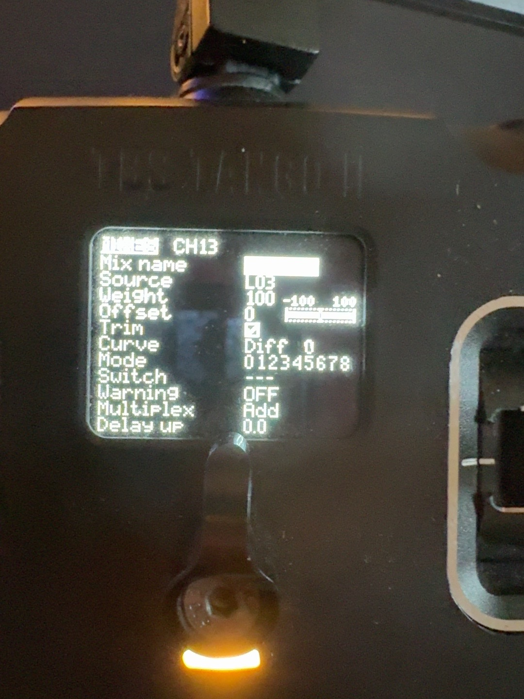

Signal flow: **SA changes position → L01 or L02 edge pulse → L03 OR → CH13 mix → USB joystick output**. Use the channel monitor to verify a momentary change in CH13 on *both* switch directions. In Windows, the exposed button number may be different from 13.

## Suggested helicopter bindings (tested physical layout)

These are the assignments used on this Tango 2. The **physical switch** matters more than any Windows button number: check your own mapping with `joy.cpl` and bind in Wardogs by operating the intended control.

| Tango 2 control | Wardogs assignment | Notes |
| --- | --- | --- |
| Left stick vertical (Thr) | Collective | Non-self-centring stick; turn self-centring collective off in-game. |
| Left stick horizontal (Rud) | Yaw | Axis 3 in the photographed configuration. |
| Right stick vertical (Ele) | Pitch | Axis 2, with invert pitch enabled in-game. |
| Right stick horizontal (Ail) | Roll | Axis 1. |
| Left three-position rocker (SB) | First-/third-person view toggle | The three-point CV1 V curve makes either end produce the same action, with neutral centre. |
| Left two-position rocker | Tactical map / minimap | AutoHotkey detects its Windows button as `1Joy5` on this PC. |
| Right two-position rocker (SA) | Minigun on/off **and** fire | Both functions are intentionally bound to this same rocker in the current setup; L01/L02/L03 generates a momentary pulse in either direction. |
| Left rear momentary push-button | Drop cargo | A genuine button, not a latching switch. |
| Right rear momentary push-button | Flare | A genuine button. |
| Right three-position rocker | Horn | Current assignment. |

**About the shared right-rocker binding:** Because minigun toggle and fire are assigned to the same input, flicking it can activate both actions together. This reflects the photographed/personal setup, not a recommendation for independent weapon controls. If you want separate firing and toggling, give them different inputs.

Windows joystick button numbers vary; do **not** infer them from channel numbers such as CH11 or CH13. Confirm each button in `joy.cpl`. In particular, button 3 appeared permanently active in the diagnostic, while button 5 pulsed when the **left map rocker** was flicked. The map workaround below therefore watches `1Joy5` in this tested setup.

## 4. Verify Windows buttons before binding or scripting

1. Open `joy.cpl`, select the TBS joystick and open **Properties**.
2. Flick each rocker and watch which numbered button lights up. Test **both directions** and whether it returns to off.
3. If using AutoHotkey, identify the button from AutoHotkey's perspective too. Joystick IDs and button numbers can differ across devices/configurations.
4. Do not assume the first lit button is your rocker: in this setup **button 3 was permanently active**, while **button 5 briefly activated** on the map rocker. That distinction explained why the first scripts never fired.

For a quick AutoHotkey v2 diagnostic, save and run:

```ahk
#Requires AutoHotkey v2.0
#SingleInstance Force
SetTimer CheckButtons, 50
CheckButtons() {
    active := ""
    Loop 32 {
        if GetKeyState("1Joy" A_Index)
            active .= A_Index " "
    }
    ToolTip "Active joystick buttons: " (active = "" ? "none" : active)
}
```

If nothing changes, check whether the Tango 2 is joystick **2** or another ID rather than `1`, and inspect the radio's channel monitor.

## 5. Tactical-map cursor workaround (optional)

On this setup, opening the map with the radio places the cursor over the helicopter's central marker, displaying a tooltip over the map. Wardogs' Free Cursor setting did not solve it. The workaround waits 300 ms after the **actual map rocker button** becomes active, then moves the Windows cursor to the top-right of the primary display (20 px inset). The game's map binding stays assigned directly to the joystick button.

Install **AutoHotkey v2**, then run [`scripts/wardogs-map-cursor.ahk`](scripts/wardogs-map-cursor.ahk). The tested script polls `1Joy5` every 20 ms, acts only on a new press, and retains **F8** as a manual fallback. Edit `1Joy5` for your joystick ID/button. The cursor target uses `A_ScreenWidth` and `A_ScreenHeight` screen coordinates; on a multi-monitor arrangement you may need to adapt the target.

```ahk
#Requires AutoHotkey v2.0
#SingleInstance Force
CoordMode "Mouse", "Screen"
SetTimer WatchMapButton, 20

WatchMapButton() {
    static wasPressed := false
    pressed := GetKeyState("1Joy5")
    if (pressed && !wasPressed) {
        Sleep 300
        MouseMove A_ScreenWidth - 20, 20, 0
    }
    wasPressed := pressed
}

F8::MouseMove A_ScreenWidth - 20, 20, 0
```

**Why polling?** We confirmed the joystick's actual brief pulse with a live button-state diagnostic. An earlier script watched permanently-active button 3, so it never saw a new press. A manual F8 test confirmed that Wardogs accepted AutoHotkey mouse movement before the correct button was identified.

## Troubleshooting

| Symptom | Check |
| --- | --- |
| Sticks do not respond | USB data cable, joystick mode, HOTAS enabled, and axes in `joy.cpl`. |
| Pitch/collective moves the wrong way | Check the corresponding in-game invert option and actual axis direction. |
| Rocker only works every other flick | Check both `Edge` inputs, the `OR` logical switch, and CH13 channel monitor. |
| Button appears permanently held | Identify *all* active buttons; it may be a different switch/button, not the rocker. |
| Fast flicks get missed | Inspect edge pulse timing and allow a release between triggers. |
| F8 moves cursor but rocker doesn't | Verify the correct joystick ID/button in AutoHotkey; don't assume channel number = button number. |
| Cursor still covers map | Increase `Sleep 300` slightly; confirm the game is focused and screen-coordinate target is appropriate. |
| Script appears unchanged | Exit/reload the previous AutoHotkey instance; `#SingleInstance Force` helps. |

## Scope and credits

Documented from Dean's working Tango 2 / FreedomTX 1.3.5 and Wardogs setup, including the supplied photos and live Windows/AutoHotkey troubleshooting. Other radio revisions, firmware, game updates and screen arrangements may require adjustment. This is an unofficial community guide, not affiliated with TBS or the Wardogs developers.

## Support

If this guide saved you some tinkering, you can [buy me a coffee](https://buymeacoffee.com/deanyo).
