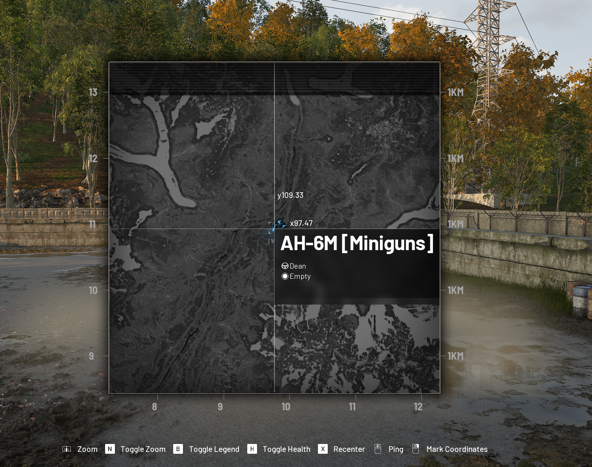
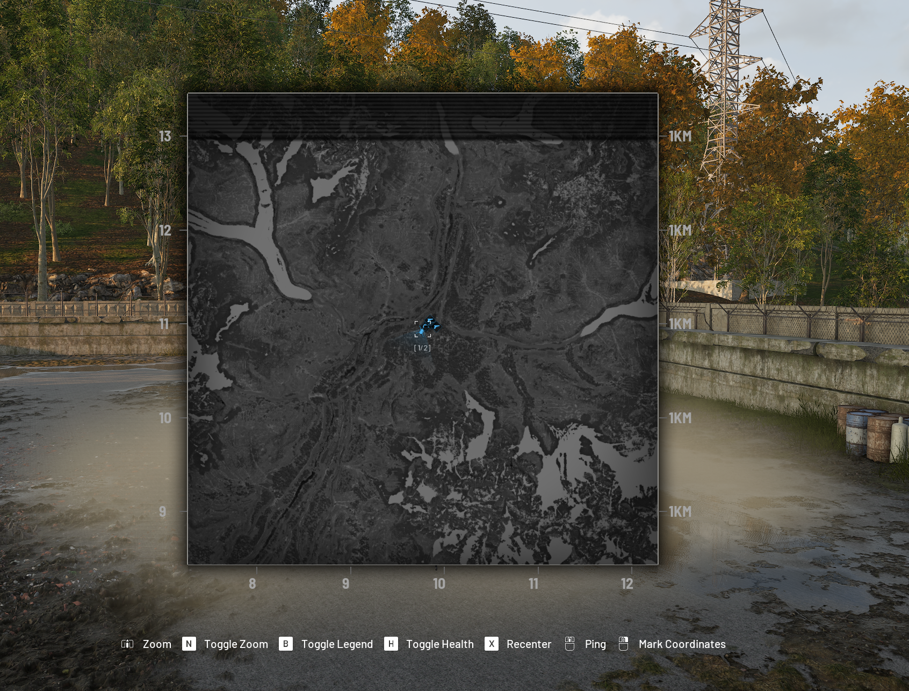

# Flying helicopters in Wardogs with a TBS Tango 2

[](https://buymeacoffee.com/deanyo)


I've been using my Tango 2 to fly helicopters in Wardogs, so figured I'd document the setup. The sticks were straightforward; getting the rockers to behave like proper Windows buttons took a bit more messing about.

This covers my FreedomTX mixes, logical switches, in-game binds and a small AutoHotkey fix for the tactical map deciding to display a massive helicopter tooltip right in the middle of the screen.

> **Radio/firmware:** TBS Tango 2, FreedomTX **TBS-1.3.5** (`fdtX-tango`, build `dd3f9713`, 10 May 2022). That's TBS's OpenTX fork, **not EdgeTX**. Other radios and firmware may have different menus or USB mappings. This is what works on mine, not a universal preset. Back up your model first, and keep the gaming model separate from anything you use to fly actual aircraft.


## TL;DR — get flying

1. Back up your radio model and make a separate one for gaming. I'm on **FreedomTX 1.3.5**.
2. Put the four sticks on **CH1–CH4**: Thr (collective), Ail (roll), Ele (pitch), Rud (yaw).
3. Move switch mixes to **CH9 onwards**. CH1–CH8 show up as axes in Windows; CH9 onwards are buttons. This was the bit that caught me out.
4. Connect by USB, select **USB joystick** mode, then run `joy.cpl` in Windows to check the sticks and see which buttons actually light up.
5. Enable **HOTAS** under **Wardogs → Settings → Gamepad → HOTAS** and bind the axes. Mine uses inverted pitch, self-centring collective **off** and 0.03 deadzones.
6. Bind your rockers and buttons. The **three-point V curve** handles both ends of the three-way rocker; the **L01/L02/L03** setup makes the two-way rocker give a short press in either direction.
7. Optional, but worth it: install AutoHotkey v2 and run [`scripts/wardogs-map-cursor.ahk`](scripts/wardogs-map-cursor.ahk). It moves the cursor out of the way when the map opens. Change `1Joy5` if your map rocker uses a different button.

### My binds

| Tango 2 control | Wardogs action |
| --- | --- |
| Left stick up/down | Collective |
| Left stick left/right | Yaw |
| Right stick up/down | Pitch |
| Right stick left/right | Roll |
| Left three-position rocker | First-/third-person view |
| Left two-position rocker | Tactical map |
| Right two-position rocker | Minigun toggle + fire (shared binding) |
| Left rear push-button | Drop cargo |
| Right rear push-button | Flare |
| Right three-position rocker | Horn |

Bind by flicking the actual control, not by copying my Windows button numbers. [More detail on the binds below](#suggested-helicopter-binds-my-layout).

That's enough to get going. The rest is the exact setup and screenshots if you want to copy it.

## What you'll need

- TBS Tango 2 with a dedicated model for PC gaming, connected by a **data-capable USB cable**; choose its USB joystick mode when prompted.
- Wardogs on Windows; enable **HOTAS** under **Settings → Gamepad → HOTAS**.
- Windows `joy.cpl` (press Win+R and enter `joy.cpl`) to inspect the actual joystick axes and buttons.
- Optional: [AutoHotkey v2](https://www.autohotkey.com/) for the tactical-map cursor workaround.


## 1. Sticks and mixes

The four main inputs are `Thr`, `Ail`, `Ele` and `Rud`, all at 100% in my Inputs/Mixes screen. The switches sit on later channels. Radio channel numbers and Windows button numbers aren't the same thing.

### Why CH9 onwards matters

This was the main gotcha. In the classic OpenTX-style USB joystick mapping, **CH1–CH8 are analogue axes** and **CH9–CH32 are buttons** (pressed when the channel output is above zero). See the [OpenTX joystick docs](https://doc.open-tx.org/manual-for-opentx-2-2/advanced-features/radio_joystick). My FreedomTX setup behaves the same way.

I'd originally put some switches on CH5–CH8 and wondered why the game wasn't treating them as buttons. Moving them to **CH9 onwards** sorted it. The four sticks stay on CH1–CH4; CH5–CH8 are unused here.

| Radio channel range | USB interpretation | Our use |
| --- | --- | --- |
| CH1–CH4 | Analogue axes | Collective, roll, pitch, yaw |
| CH5–CH8 | Analogue axes | Left unused |
| CH9 onward | Digital buttons | Rockers, rear push-buttons and logical-switch pulse |

With this mapping, CH9 is Windows button 1 and CH13 is button 5. Check your own setup in `joy.cpl` rather than assuming it'll match mine.


### My Wardogs HOTAS settings

| Wardogs control | Binding shown in game | Setting shown |
| --- | --- | --- |
| Roll left / right | Axis 1− / Axis 1+ | Invert disabled; sensitivity 1.00; deadzone 0.03 |
| Pitch up / down | Axis 2− / Axis 2+ | Invert enabled; sensitivity 1.00; deadzone 0.03 |
| Yaw left / right | Axis 3− / Axis 3+ | Invert disabled; sensitivity 1.50; deadzone 0.03 |
| Collective up / down | Axis 0+ / Axis 0− | Invert disabled; sensitivity 1.00; deadzone 0.03; **self-centring collective disabled** |

Those axis numbers are what Wardogs shows on my PC. My non-centring throttle stick is collective. Check the directions in-game and invert anything that feels backwards.


## 2. Three-way rocker — same button at either end

I wanted either direction of the left three-way rocker to toggle first/third person, with the middle doing nothing. A simple **three-point V curve** does it. Mine is `CV1` (named `ab`), applied to `SB` on CH11.


The curve is just:

| Point | X (input) | Y (output) |
| --- | ---: | ---: |
| Left | -100 | +100 |
| Centre | 0 | 0 |
| Right | +100 | +100 |

Both ends output +100; the middle outputs 0. It's a genuine three-point V, not a six-point curve. Check it in the radio's channel monitor and then in `joy.cpl`.

## 3. Two-way rocker — a press in either direction

A normal two-way switch stays on or off, which isn't great when you want a button press every time you flick it. I used two edge-detection logical switches and OR'd them together:

| Logical switch | Function | Input |
| --- | --- | --- |
| L01 | Edge | SA↓ |
| L02 | Edge | SA↑ |
| L03 | OR | L01, L02 |

The photo shows the logic, but the tiny timing fields aren't clear enough for me to give you an exact value. Adjust the pulse until Windows catches both directions reliably. Too short and it'll miss presses; flick it very quickly and you may still outrun the pulse.


**CH13 mix:** Source `L03`, weight `100`, offset `0`, trim off, curve `Diff 0`, no additional switch, multiplex `Add`, delay up `0.0`.


In short: **SA moves → L01 or L02 pulses → L03 combines them → CH13 outputs a button press**. Check CH13 in the channel monitor in both directions, then check Windows. CH13 does not mean Windows button 13.

## Suggested helicopter binds (my layout)

This is how I've got mine mapped. Use whatever feels right, but I'd start with the physical layout rather than copying button numbers.

| Tango 2 control | Wardogs assignment | Notes |
| --- | --- | --- |
| Left stick vertical (Thr) | Collective | Non-self-centring stick; turn self-centring collective off in-game. |
| Left stick horizontal (Rud) | Yaw | Axis 3 in the photographed configuration. |
| Right stick vertical (Ele) | Pitch | Axis 2, with invert pitch enabled in-game. |
| Right stick horizontal (Ail) | Roll | Axis 1. |
| Left three-position rocker (SB) | First-/third-person view toggle | The three-point CV1 V curve makes either end produce the same action, with neutral centre. |
| Left two-position rocker | Tactical map / minimap | AutoHotkey detects its Windows button as `1Joy5` on this PC. |
| Right two-position rocker (SA) | Minigun on/off **and** fire | Both functions are intentionally bound to this same rocker in the current setup; L01/L02/L03 generates a momentary pulse in either direction. |
| Left rear momentary push-button | Drop cargo | A genuine button, not a latching switch. |
| Right rear momentary push-button | Flare | A genuine button. |
| Right three-position rocker | Horn | Current assignment. |

I've got minigun toggle and fire on the same right rocker. That means a flick can trigger both; if you'd rather keep them separate, give them different buttons.

Check button numbers in `joy.cpl`. On my PC, button 3 was permanently active and button 5 was the one that pulsed when I flicked the **left map rocker**. That's why the map script watches `1Joy5`.

## 4. Check what Windows is actually seeing

1. Open `joy.cpl`, select the TBS joystick and open **Properties**.
2. Flick each rocker and watch which numbered button lights up. Test **both directions** and whether it returns to off.
3. If using AutoHotkey, identify the button from AutoHotkey's perspective too. Joystick IDs and button numbers can differ across devices/configurations.
4. Do not assume the first lit button is your rocker: in this setup **button 3 was permanently active**, while **button 5 briefly activated** on the map rocker. That distinction explained why the first scripts never fired.

If you're not sure which button is which, this little AutoHotkey v2 script lists the ones currently active:

```ahk
#Requires AutoHotkey v2.0
#SingleInstance Force
SetTimer CheckButtons, 50
CheckButtons() {
    active := ""
    Loop 32 {
        if GetKeyState("1Joy" A_Index)
            active .= A_Index " "
    }
    ToolTip "Active joystick buttons: " (active = "" ? "none" : active)
}
```

If nothing changes, your radio might be joystick **2** rather than `1`. Check the radio's channel monitor too.

## 5. Fix the tactical map tooltip (optional, but lovely)

This one was doing my head in. Open the map with the rocker and Wardogs leaves the mouse right over your helicopter, which brings up a huge hover tooltip. Add passengers and it gets even worse. The in-game Free Cursor option didn't help.

The fix is a tiny AutoHotkey script: wait 300 ms after opening the map, then shove the mouse into the top-right corner. The map button itself stays bound in Wardogs.

### Before / after

Here's what I mean:

**Before:** Mouse on the heli marker, massive tooltip.



**After:** Mouse out of the way, map actually usable.



Install **AutoHotkey v2** and run [`scripts/wardogs-map-cursor.ahk`](scripts/wardogs-map-cursor.ahk). It checks `1Joy5` every 20 ms, moves the cursor on a new press and keeps **F8** as a manual fallback. Change `1Joy5` to your map button if needed. If you've got multiple monitors, you may need to adjust the target coordinates.

```ahk
#Requires AutoHotkey v2.0
#SingleInstance Force
CoordMode "Mouse", "Screen"
SetTimer WatchMapButton, 20

WatchMapButton() {
    static wasPressed := false
    pressed := GetKeyState("1Joy5")
    if (pressed && !wasPressed) {
        Sleep 300
        MouseMove A_ScreenWidth - 20, 20, 0
    }
    wasPressed := pressed
}

F8::MouseMove A_ScreenWidth - 20, 20, 0
```

**Why button 5?** I initially thought the map rocker was button 3. It wasn't — button 3 was permanently active and button 5 was the one flashing when I flicked the rocker. That's why the first scripts did absolutely nothing. F8 proved mouse movement worked, and changing the watched button to 5 sorted it. Polling is just the version I ended up using; we didn't establish that a normal `1Joy5` hotkey wouldn't work.

## Troubleshooting

| Symptom | Check |
| --- | --- |
| Sticks do not respond | USB data cable, joystick mode, HOTAS enabled, and axes in `joy.cpl`. |
| Pitch/collective moves the wrong way | Check the corresponding in-game invert option and actual axis direction. |
| Rocker only works every other flick | Check both `Edge` inputs, the `OR` logical switch, and CH13 channel monitor. |
| Button appears permanently held | Identify *all* active buttons; it may be a different switch/button, not the rocker. |
| Fast flicks get missed | Inspect edge pulse timing and allow a release between triggers. |
| F8 moves cursor but rocker doesn't | Verify the correct joystick ID/button in AutoHotkey; don't assume channel number = button number. |
| Cursor still covers map | Increase `Sleep 300` slightly; confirm the game is focused and screen-coordinate target is appropriate. |
| Script appears unchanged | Exit/reload the previous AutoHotkey instance; `#SingleInstance Force` helps. |

## Notes

This is my own Tango 2 / FreedomTX 1.3.5 setup, with screenshots taken along the way. It works here; you might need to tweak things for another radio, firmware or screen layout. Not affiliated with TBS or the Wardogs developers.

## Support

If this saved you an evening of swearing at joystick bindings, you can [buy me a coffee](https://buymeacoffee.com/deanyo).
